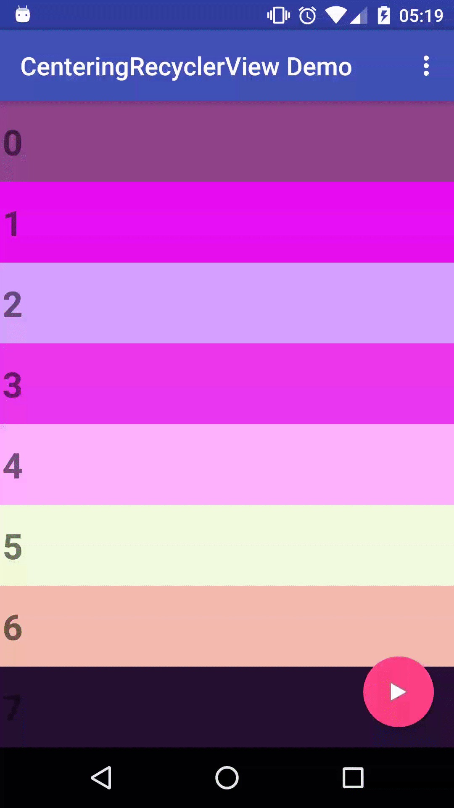

# Centering Recycler View (Android)
A view aligning (center, top, bottom, start, end) RecyclerView.

###centering demo



Download [  ](https://bintray.com/mightyfrog/maven/centering-recycler-view/_latestVersion)
--------

```groovy
compile 'org.mightyfrog.centeringrecyclerview:centeringrecyclerview:1.0.8'
```

Usage
--------
####center, head, tail(int position) - scrolls to center, head, or tail
```java
CenteringRecyclerView mRecyclerView;
...
int position = 100; // adapter position
mRecyclerView.center(position);

mRecyclerView.head(position); // vertical: align top, horizontal: align left 

mRecyclerView.tail(position); // vertical: align bottom, horiztal: align right
```
####snap(int, int) - snaps to a closer end
```java
CenteringRecyclerView mRecyclerView;
...
mRecyclerView.snap(10, CenteringRecyclerView.SNAPPING_STRATEGY_CENTER);
```
####alternative method: setSelection(int position, int alignment)
```java
CenteringRecyclerView mRecyclerView;
...
int position = 100; // adapter position
mRecyclerView.setSelection(position, CenteringRecyclerView.ALIGN_CENTER);
```

If you don't want already (completely) visible views re-layout, set `ignoreIfVisible` or `ignoreIfCompletelyVisible` to true.
```java
mRecyclerView.setIgnoreIfVisible(true);

mRecyclerView.setIgnoreIfCompletelyVisible(true);
```

**XML attributes**
```xml
<org.mightyfrog.widget.CenteringRecyclerView
  ...
  app:ignoreIfVisible="true" />

<org.mightyfrog.widget.CenteringRecyclerView
  ...
  app:ignoreIfCompletelyVisible="true" />

```

**other public methods**

`isVisible(int);`

`isCompletelyVisible(int)`

`getFirstVisiblePosition()`

`getLastVisiblePosition()`

`getFirstCompletelyVisiblePosition()`

`getLastCompletelyVisiblePosition()`


License
--------
Copyright 2015 Shigehiro Soejima.

Licensed to the Apache Software Foundation (ASF) under one or more contributor
license agreements. See the NOTICE file distributed with this work for
additional information regarding copyright ownership. The ASF licenses this
file to you under the Apache License, Version 2.0 (the "License"); you may not
use this file except in compliance with the License. You may obtain a copy of
the License at

http://www.apache.org/licenses/LICENSE-2.0

Unless required by applicable law or agreed to in writing, software
distributed under the License is distributed on an "AS IS" BASIS, WITHOUT
WARRANTIES OR CONDITIONS OF ANY KIND, either express or implied. See the
License for the specific language governing permissions and limitations under
the License.
